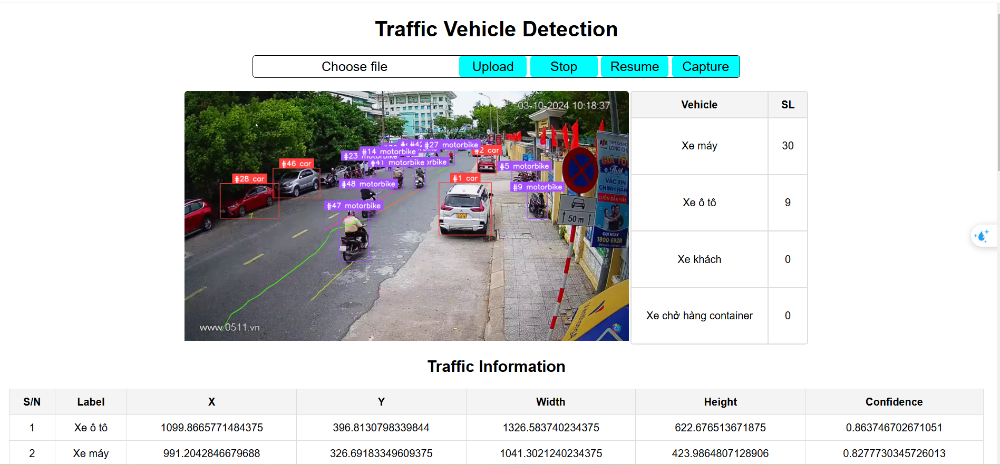

<div align="center">
    <h1>Traffic-Vehicle-Detection-in-Normal-and-Adverse-Environmental-Conditions</h1>
    <h2>Giáo viên hướng dẫn: Đỗ Văn Tiến</h2>
</div>

## THÀNH VIÊN NHÓM
<a name="thanhvien"></a>
| STT    | MSSV          | Họ và Tên              | Github                                               | Email                   |
| ------ |:-------------:| ----------------------:|-----------------------------------------------------:|-------------------------:
| 1      | 22521184      | Nguyễn Đình Quân       |[nguyenquan132](https://github.com/nguyenquan132)     |22521184@gm.uit.edu.vn   |
| 2      | 22521067      | Hà Hữu Phát            |[mbyhphat](https://github.com/mbyhphat)               |22521067@gm.uit.edu.vn   |
| 3      | 22521074      | Nguyễn Hùng Phát       |[phat9824](https://github.com/phat9824)               |22521074@gm.uit.edu.vn   |

## Demo: 


### **1. Mô tả bài toán**: 
* Phát hiện phương tiện giao thông là một nhiệm vụ quan trọng trong quản lý giao thông, an ninh công cộng và phát triển thành phố thông minh. Tuy
nhiên, trong điều kiện thời tiết bất lợi như mưa lớn, sương mù dày đặc hoặc ánh sáng yếu vào ban đêm, việc phát hiện phương tiện trở nên phức tạp do tầm
nhìn bị hạn chế và các đặc điểm của phương tiện dễ bị che khuất, những thách thức này là nguyên nhân làm giảm hiệu quả của các hệ thống giám sát
hiện tại. Các phương pháp truyền thống, mặc dù hiệu quả trong điều kiện lý tưởng, thường gặp khó khăn trong việc xử lý các yếu tố môi trường đa dạng và yêu
cầu thời gian thực. Để giải quyết những hạn chế này, trong bài toán này nhóm chúng em áp dụng các kỹ thuật học sâu như YOLO, SSD và Faster R-CNN.
* **Input**: 
     *  Ảnh chụp các phương tiện giao thông trong các điều kiện ánh sáng khác nhau:
          * Ảnh ban ngày: Với độ sáng tự nhiên và màu sắc rõ ràng.
          * Ảnh ban đêm: Ánh sáng yếu, bị ảnh hưởng bởi đèn pha hoặc bóng tối.
     *  Nhãn dữ liệu bao gồm:
          * Xe máy: 0
          * Xe ô tô con: 1
          * Xe vận tải du lịch (xe khách): 2
          * Xe vận tải container: 3
* **Output**:
     * Bounding box xung quanh các phương tiện giao thông được phát hiện trong ảnh.
     * Nhãn tương ứng với từng bounding box, thể hiện loại phương tiện được phát hiện.
### **2. Công nghệ sử dụng**
- **Ngôn ngữ lập trình**: Python
- **Framework Backend**: Flask
- **Frontend**: HTML, CSS, JavaScript
- **Container hóa**: Docker
### **3. Pipeline thực hiện**


### **4. Cài đặt và chạy ứng dụng**
* **Clone repository**: ```https://github.com/nguyenquan132/Traffic-Vehicle-Detection-in-Normal-and-Adverse-Environmental-Conditions.git```
* **Pull Docker image từ Docker Hub**: ```docker pull hightfight/computer_vision:latest```
* **Chạy Docker container**: ```docker run -p 9000:5000 hightfight/computer_vision:latest``` (có thể sử dụng port tùy ý ngoài port 9000)
* **Cấu trúc trang web**: 
```
    project/
        ├── app.py
        ├── requirements.txt
        ├── Dockerfile
        └── templates/
            └── traffic.html/
```

### **6. Kết quả**
     Model                | F1 Score |   mAP@50  | mAP@50-95 |   
|:-----------------------:|:--------:| ---------:|-----------:
|     Yolov8s             | 0.901486 |   0.942   |    0.711  | 
|    Yolov11s             |  0.9015  |   0.943   |    0.712  |
| Yolov8s + enhanced data | 0.903478 |   0.943   |    0.737  | 
|Yolov11s + enhanced data |  0.9055  |   0.946   |     0.74  |     

     Model                     | Backbone     |  F1 Score | mAP@50   | mAP@50-95 |   
|:----------------------------:|:------------:| ---------:|---------:|-----------:
|     Faster RCNN              | ResNet50     |  0.6483   |  0.6283  |   0.5585  | 
| Faster RCNN + enhanced data  | ResNet50     |  0.6818   |  0.7244  |   0.5625  |
|     Faster RCNN              | MobileNet V3 |  0.6922   |  0.7422  |   0.5883  | 
| Faster RCNN + enhanced data  | MobileNet V3 |  0.7739   |  0.8219  |   0.6213  |

     Model                      | F1 Score | mAP@50 | mAP@50-95  |   
|:-----------------------------:|:--------:| ---------:|---------:
|     SSD (300x300)             |  0.6364  |  0.724481 | 0.43526 | 
| SSD (300x300) + enhanced data |  0.7248  |   0.7248  | 0.43529 |
|     SSD (512x512)             |  0.6401  |  0.725481 | 0.43616 | 
| SSD (512x512) + enhanced data |  0.6407  |  0.725502 | 0.4362  |
